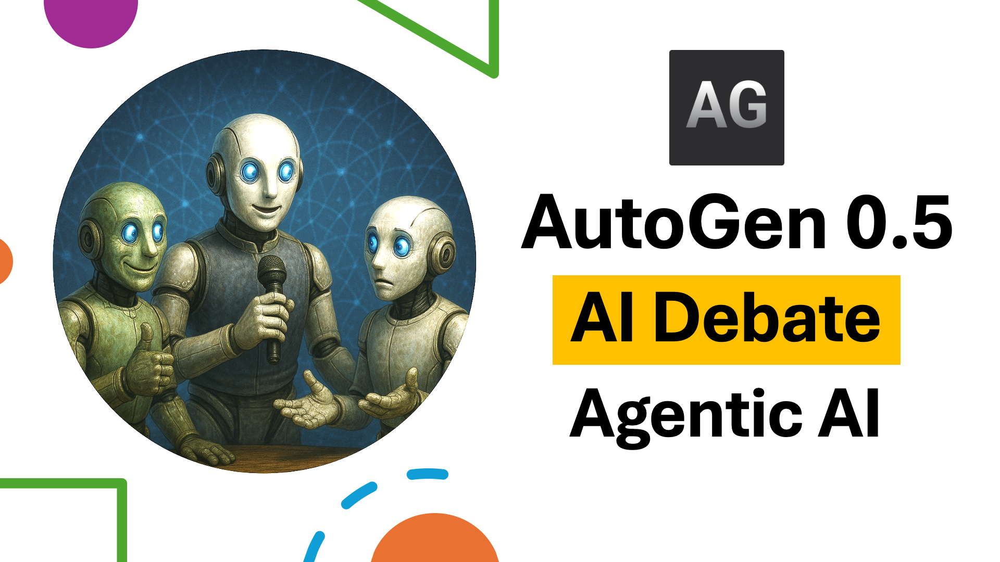

## Multi-Agent Debate System


This project leverages **Autogen's multi-agent framework** to implement a **round-robin chat** debate simulation. The system consists of:

- **Supporter Agent (Victoria)** – argues in favor of the topic.
- **Critic Agent (Daniel)** – argues against the topic.
- **Host Agent (Mercy)** – moderates the debate, announces rounds, and declares the winner.

## App Screenshot


## App Screenshot


## App Screenshot


## App Screenshot


**Key points about the implementation:**

- **Round-Robin Message Handling**: Each agent takes turns responding in a structured round, coordinated by Autogen's `RoundRobinGroupChat`.
- **Asynchronous Streaming**: Messages are generated asynchronously via `asyncio` and streamed back to the frontend in real time.
- **Termination Control**: The debate ends when the host agent announces “TERMINATE,” using Autogen's `TextMentionTermination` condition.
- **Agent Roles & Prompts**: Each agent has a distinct system prompt guiding their behavior, ensuring coherent arguments and debate structure.
- **Flexible Topics**: Users can define their own topics dynamically, and the system updates agent prompts accordingly.

This approach showcases **Autogen’s ability to manage multiple AI agents interacting in a controlled conversational environment**, making it suitable for simulations, educational tools, and multi-agent research applications.

It uses **Groq LLMs** for generating responses, **FastAPI** as the backend server, and **Streamlit** for the frontend interface. Users can enter their own debate topics and watch AI agents debate in real time.

---

## Features

- **User-defined Topics**: Users can input any debate topic.
- **AI Agents**: Two agents (supporter and critic) argue for and against the topic.
- **Host Agent**: A moderator agent announces rounds and declares the winner.
- **Streaming Responses**: Debate messages are streamed in real-time to the frontend.
- **Backend-Frontend Integration**: FastAPI handles requests while Streamlit provides an interactive interface.

---

## Tech Tools

- **Python 3.13+**
- **Groq LLMs** (`deepseek-r1-distill-llama-70b` or other compatible models)
- **FastAPI** – backend API server
- **Streamlit** – frontend interface
- **Autogen AgentChat** – to manage AI agents and debates
- **Asyncio** – asynchronous streaming of messages
- **CORS Middleware** – allows frontend and backend communication

---

## Installation

1. Clone the repository:
    ```bash
    git clone https://github.com/vic-775/Debating-Agents-.git
    cd debate-simulation
    ```

2. Create a virtual environment:

3. Install dependencies:
    ```bash
    pip install -r requirements.txt
    ```

4. Create a `.env` file in the root directory with your Groq API key:
    ```env
    GROQ_API_KEY=your_groq_api_key_here
    ```

---

## Backend Usage

Start the FastAPI server:

```bash
uvicorn backend.main:app --reload
```

## Learning & Insights

From building this Multi-Agent Debate System, I learned:

- **Multi-Agent Coordination**: How to manage multiple AI agents in a structured interaction using Autogen’s RoundRobinGroupChat.

- **Agent Prompt Engineering**: Crafting distinct system prompts for supporter, critic, and host agents to ensure coherent and meaningful debate outputs.

- **Asynchronous Streaming**: Using asyncio to stream messages in real-time, improving responsiveness in interactive applications.

- **Backend-Frontend Integration**: Connecting FastAPI with Streamlit for seamless user interaction and real-time data display.

- **Dynamic Topic Handling**: Designing agents to adapt their arguments to user-provided topics, demonstrating flexible AI behavior.

- **Termination Conditions**: Using TextMentionTermination to control conversation flow programmatically.
